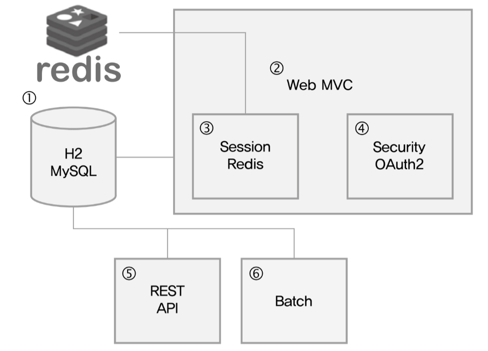
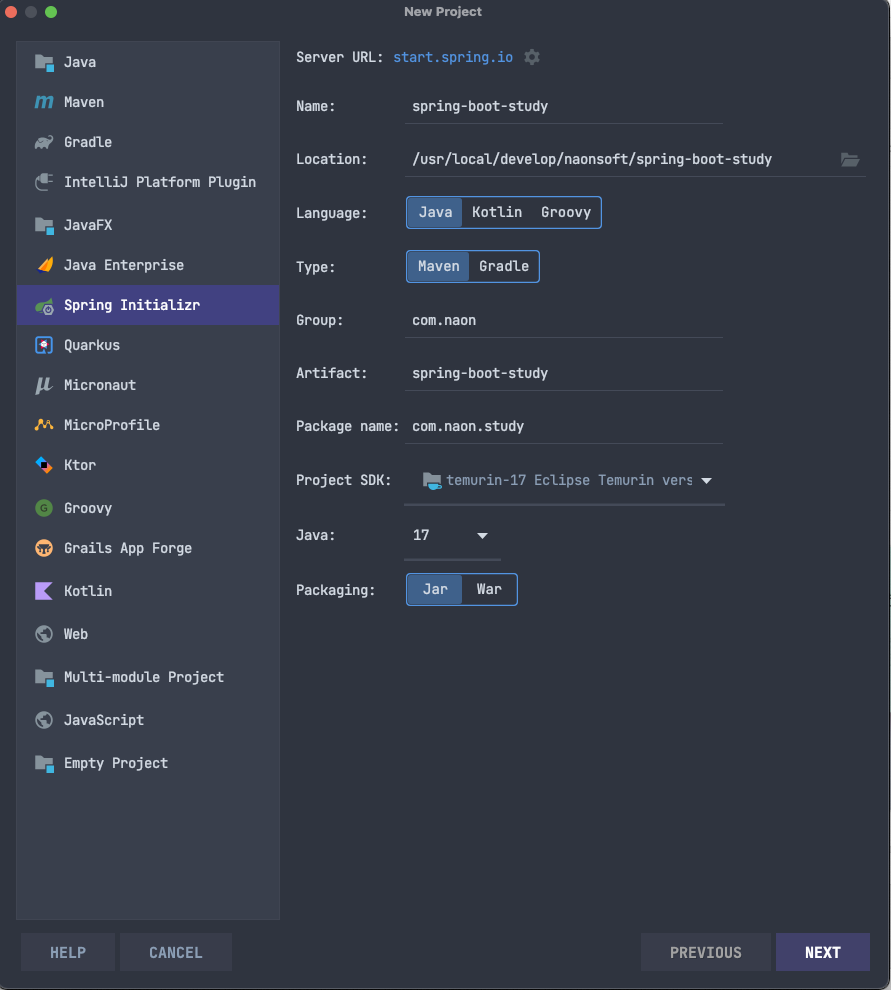
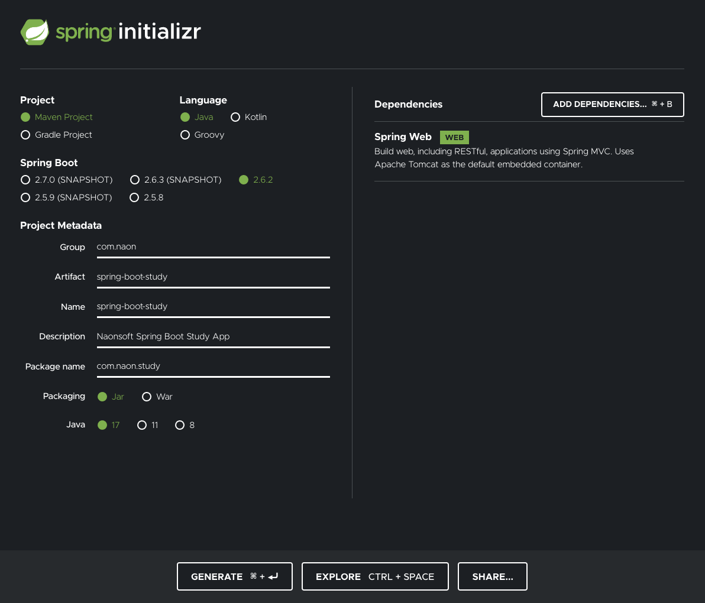

# 1. 스프링 부트
* 스프링 부트 레퍼런스
  * 영몬 : https://docs.spring.io/spring-boot/docs/current/reference/html/
  * 한글 : https://godekdls.github.io/Spring%20Boot/contents/
  * 
## 1.1. 특징
* **독립 실행이 가능한 스프링 애플리케이션 개발**(Embedded Tomcat, Jetty, Undertow를 사용)
* **통합 Starter를 제공하여 Maven/Gradle 구성을 간소화**
* **Starter를 통한 자동화된 스프링 설정 제공**
* **번거로운 XML 설정을 요구하지 않음**
* **JAR을 이용하여 자바 옵션만으로도 배포 가능**
* **Spring Actuator 제공**(애플리케이션의 모니터링과 관리를 위해 사용)*

## 1.2 스프링 부트에 대한 오해
* 스프링 부트는 스프링 프레임워크과 다른 프로젝트이다. (No)
  * 스프링 부트는 스프링 프레임워크 내에서 설정을 간소화한 스프링 프레임워크의 일부
    * 스프링을 모르면 스프링 부트로 개발 항 수 없음
      * 따라서 교욕 진행을 위하여 푈요하다고 생각하는 개념은 설명
    * 스프링 부트를 특징에 맞게 잘 사용한다면 스프링 프레임워크의 장점까지 더하여 빠르게 서비스를 개발할 수 있음
  * 스프링 부트는 토이 프로젝트 용도이고 특히 내장 WAS는 느리고 설정을 커스터이이징 할수 없다  (No)
    * 스프링 부트 레퍼런스 정의 확인
      * [Spring Boot Reference Documentation](https://docs.spring.io/spring-boot/docs/current/reference/htmlsingle/#getting-started)
      * Spring Boot helps you to create stand-alone, **production-grade** Spring-based applications that you can run. 
      * We take an **opinionated view** of the Spring platform and third-party libraries, so that you can get started with minimum fuss. 
      * Most Spring Boot applications need very little Spring configuration.
    
    * production-grade, opinionated view에 주목
      * 스프링 부트는 스프링 기반 애플리케이션을 독립형, 프로덕션 레벨로 만들고 실행할 수 있게 도와준다. 
      * 스프링 부트는 스프링 플랫폼과 써드 파티 라이브러리들의 설계 철학을 최대한 수용하기 때문에, 큰 고민 없이 바로 시작할 수 있다. 
      * 스프링 부트 애플리케이션 대부분은 아주 적은 양의 스프링 설정으로도 충분하다.
    * 나온톡 서버 설정 일부
      * 설정을 커스터 아이징 가능하고 최적화된 기본 설정값 제공함
          * SSL 설정둥 다양한 커스터 마이징이 가능함
            * https://docs.spring.io/spring-boot/docs/current/reference/html/application-properties.html#application-properties.server
          * tomcat Max Thread는 기본값이 200 (나온톡에서는 1,000으로 설정)
            * 스프링 재단의 전문가들이 설정으로 기본설정으로만 상용환경에서 충분한 성능 보장
              * tomcat 을 직접 설치하면 설정이 설정 최적화는 필수임

```yaml
server:
  compression:
    enabled: true
    mime-types: application/json,application/xml,text/html,text/xml,text/plain,text/css,application/javascript
  error:
    path: /WEB-INF/jsp/error
  port: 43300
  ssl:
    enabled: false
    key-store: /opt/naon/app/apache2/conf/ssl/messenger/GLO_ORG_MDC_SSLG351994.p12
    key-store-type: PKCS12
    key-store-password: tjpssl18826
  tomcat:
    accesslog:
      buffered: true
      directory: /opt/naon/webMessengerServer/logs
      enabled: true
      file-date-format: .yyyy-MM-dd
      pattern: combined
      prefix: access_log_api
      rename-on-rotate: true
      request-attributes-enabled: true
      rotate: true
      suffix: .log
    threads:
      max: 1024
  servlet:
    context-path: /webmsgr/api
    encoding:
      force: true
      force-request: true
      force-response: true
    register-default-servlet: true
  forward-headers-strategy: native
```
  
***

# 2. Spring Boot 기반 프로젝트 만들기
## 2.1. 앞으로 만들 프로젝트 구조

* ①세션 레디스(Session Redis), H2(또는 MySQL) : 세션을 관리하는NoSQL(레디스)과 기본 데이 터 저장을 위한 RDB(H2, MySQL) 사용 
* ② 스프링 부트 웹 MVC(Spring Boot Web MVC): 기본적인 커뮤니티페이지
* ③ 스프링 부트 세션 레디스(Spring Boot Session Redis): 레디스를 사용한 세션 관리 
* ④ 스프링 부트 시큐리티(Spring Boot Security)/스프링 부트 OAuth2(Spring Boot OAuth2): 회원 인증 및 권한 처리
* ⑤ 스프링 부트 데이터 레스트(Spring Boot Data REST) : REST API 만들기
* ⑥ 스프링 부트 배치(Spring Boot Batch): 주기적으로 백엔드 작업 처리.(조직도 연동등)

### 2.1.1. IntelliJ Untimate
IDE에서 지원하는 Spring Initalizr 사용


### 2.1.2. IntelliJ Community
https://start.spring.io 에  접속하여 Spring Initalizr 사용


# 3. 스프링 부트 동작원리
> spring-boot-starter-web 의존성만 추가 하였는데 내장톰켓도 설정되고 수많은 의존성이 추가되었는데 어떻게 설정되었는지 알고 있으면 자동 설정 커스터 마이징시 많은 도움이 때문에 자종설정의 원리와 스트링 부트가 어떻에 의존성을 관리하는지 설명합니다.

## 3.1. 스프링 부트 스타터 들여다보기 
* 스프링에서는 의존 관계를 개발자가 일일이 설정해 번거로웠지만 스프링 부트에서는 스타터를 이용해 간편하게 설정할 수 있음
  * 스프링 부트 스타터가 빌드에 필요한 의존성을 자동으로 관리해주기 때문임
  * 스타터를 ‘특정 목적을 달성하기 위한 의존성 그룹’이라고 생각하면 이해 하기 쉬움
* 스프링 부트 스타터는개발자에게 엄청난 편리함을 제공 
  * DB 연동에 스프링과 JPA가 필요하다면 pom.xml(메이븐)이나 build.gradle(그레이들)에 spring-boot starter-data-jpa만 추가하면 됨
    * 일일이 어떤 라이브러리가 필요한지 찾아볼 필요가 없음. 

### 3.1.1. 스타터의 명명규칙 알아보기 
* spring-boot-starter-*  
  * 스프링에서 웹 관련 프로젝트를 진행 : spring-boot-starter-web
    * 명명규칙을 알면 원하는스타터를 쉽게찾을 수 있음
    * IDE에서 메이븐(pom. xml) 혹은 그레이들(build.gradle)과 같은 빌드 도구를 사용한다고가
      * 단축키 Ctrl+Space를 이용하면 spring-boot-starter 메뉴를 불러올수 있음

## 3.2. 의존성 관리
### 3.2.1. 스타터 내부의 의존성 확인 방법
pom.xml 내부를 살펴보면, 다음과 같은 부분이 있다
```xml
  <parent>
    <groupId>org.springframework.boot</groupId>
    <artifactId>spring-boot-starter-parent</artifactId>
    <version>2.6.2</version>
    <relativePath/> <!-- lookup parent from repository -->
  </parent>
```
* spring-boot-starter-parent 는 스프링 프레임워크가 제공해주는 것으로, 여기에 활용할 수 있는 많은 라이브러리 정보가 '이미' 담겨져 있다.
  * 정확히는 spring-boot-starter-parent 가 dependency 로 들어오는 외부 라이브러리들의 버전 및 각 라이브러리들의 의존성을 관리한다.
* spring-boot-starter-parent.pom
  * org.springframework.boot 의 version 에 따른 각 dependency 라이브러리들의 version 이 정의되어 있다.
    * 
```xml
  <parent>
    <groupId>org.springframework.boot</groupId>
    <artifactId>spring-boot-dependencies</artifactId>
    <version>2.6.2</version>
  </parent>
```
  * spring-boot-starter-parent 의 버전만 version 에 명시해주면, 해당 버전과 호환되는 dependecny 라이브러리들을 따로 version 을 명시해주지 않아도, spring-boot-starter-parent 에 이미 선언된 버전으로 가져온다.
  * dependency 내부에 version 을 명시해주면 해당 version 으로 오버라이딩 됨
  
#### 특정 스타터를 사용하려 하는데 의존 관계가 궁금할 때

## 3.3. 자동 설정 이해하기
> start에 있는 설정이 어떻게 자동으로 적용되는걸까?

### 3.3.1. @SpringBootApplication

```java
* @SpringBootApplication
public class SpringBootStudyApplication {
    public static void main(String[] args) {
        SpringApplication.run(SpringBootStudyApplication.class, args);
    }
}
```
* 
* @SpringBootApplication = @SpringBootConfiguration + @EnableAutoConfiguration + @ComponentScan(

```java
@Target({ElementType.TYPE})
@Retention(RetentionPolicy.RUNTIME)
@Documented
@Inherited
@SpringBootConfiguration //1)
@EnableAutoConfiguration // 2)
@ComponentScan(          // 3)   
    excludeFilters = {@Filter(
    type = FilterType.CUSTOM,
    classes = {TypeExcludeFilter.class}
), @Filter(
    type = FilterType.CUSTOM,
    classes = {AutoConfigurationExcludeFilter.class}
)}
)
public @interface SpringBootApplication {
  ...
}
```
#### @SpringBootApplication 내부 로직을 보면 @SpringBootConfiguration, @EnableAutoConfiguration, @ComponentScan 을 래핑해 놓은 것을 볼 수 있다.
* 1)**@SpringBootConfiguration*
  * Spring Boot의 설정을 나타내는 어노테이션
  * Spring의 @Configuration을 대체하여 Spring Boot 전용으로 사용되는 필수 어노테이션 중 하나

* 2)**@EnableAutoConfiguration**
  * 자동 설정의 핵심 어노테이션 
  * classpath에 지정된 내용을 기반으로 설정 자동화를 수행합니다. 특별한 설정값을 추가하지 않은 경우 기본값으로 동작

* 3)**@ComponentScan**
  * 자기 자신(애노테이션이 달린)을 가진 클래스부터 시작해서 하위 패키지까지 모두 스캔하여 @Component 뿐만 아니라 @Configuration, @Repository, @Service, @Controller, @RestController가 달린 클래스를 찾아서 빈으로 등록한다.
    * 이 때 자기 자신에게 @Configuration과 같은 애노테이션이 붙어 있다면 자신도 빈으로 등록이 된다.
  * @ComponentScan의 basePackages 프로퍼티값에 별도로 경로를 설정하지 않으면 @ComponentScan이 위치한 패키지가 basePackages의 루트 경로로 설정됨(자기 자신보다 상위에 있는 패키지나 클래스는 읽을 수 없다는 의미)

### 3.3.2. @EnableAutoConfiguration
> @EnableAutoConfiguration은 자동 설정의 핵심 어노테이션

```java
@Target(ElementType.TYPE)
@Retention(RetentionPolicy.RUNTIME)
@Documented
@Inherited
@AutoConfigurationPackage
@Import(AutoConfigurationImportSelector.class) // 1)
public @interface EnableAutoConfiguration {
  ...
}
```
* 1)**@Import({AutoConfigurationImportSelector.class})**
  * @EnableAutoConfiguration에서 자동 설정을 지원해주는 어노테이션

### 3.3.3. @AutoConfigurationImportSelector
```java
public class AutoConfigurationImportSelector implements DeferredImportSelector,
        BeanClassLoaderAware, ResourceLoaderAware, BeanFactoryAware, EnvironmentAware, Ordered {
 
    ...

  @Override
  public String[] selectImports(AnnotationMetadata annotationMetadata) {
    if (!isEnabled(annotationMetadata)) {
      return NO_IMPORTS;
    }
    AutoConfigurationMetadata autoConfigurationMetadata =
            AutoConfigurationMetadataLoader.loadMetadata(this.beanClassLoader);
    AutoConfigurationEntry autoConfigurationEntry =
            getAutoConfigurationEntry(autoConfigurationMetadata, annotationMetadata);
    return StringUtils.toStringArray(autoConfigurationEntry.getConfigurations());
  }

  protected AutoConfigurationEntry getAutoConfigurationEntry(
          AutoConfigurationMetadata autoConfigurationMetadata,
          AnnotationMetadata annotationMetadata
  ) {
    if (!isEnabled(annotationMetadata)) {
      return EMPTY_ENTRY;
    }
    AnnotationAttributes attributes = getAttributes(annotationMetadata);
    List<String> configurations = getCandidateConfigurations(annotationMetadata, attributes);
    configurations = removeDuplicates(configurations);
    Set<String> exclusions = getExclusions(annotationMetadata, attributes);
    checkExcludedClasses(configurations, exclusions);
    configurations.removeAll(exclusions);
    configurations = filter(configurations, autoConfigurationMetadata);
    fireAutoConfigurationImportEvents(configurations, exclusions);
    return new AutoConfigurationEntry(configurations, exclusions);
  }
 
    ...

}
```
* DeferredImportSelector 인터페이스를 구현한 클래스 
* 오버라이드 받은 selectImports() 메서드가 자동 설정할 Bean을 결정
* 모든 후보빈을 getCandidateConfigurations() 메서드를 사용해 불러온다.
  * META-INF/spring.factories 에 정의된 자동 설정할 클래스들을 먼저 불러온다.
* 여러 개의 spring-boot-starter를 사용할 경우 내부에 중복된 Bean 설정이 많음 
  * 이러한 경우 getExclusions(), removeDuplicates() 메서드가 제외시켜 주고
  * 이후에 프로젝트에 사용하게 될 남은 Bean 들이 자동 설정 대상으로 선택됩.
  
#### Bean 등록과 자동 설정에 사용되는 파일
* spring-boot-autoconfiguration에 미리 정의되어 있으며 지정된 프로퍼티값을 사용하여 설정 클래스 내부의 값들을 변경할 수 있음
* **META-INF/spring.factories**  
  * 자동 설정 대상 클래스 목록
  * 이 파일에 선언되어 있는 클래스들이 @EnableAutoConfiguration 사용시 자동 설정 대상이 됩
* **META-INF/spring-configuration-metadata.json**  
  * 자동 설정에 사용할 프로퍼티 정의 파일
  * 미리 구현되어 있는 자동 설정에 프로퍼티만 주입시켜주면 된다.
  * 변경을 위해서는 application.properties 나 application.yml에 프로퍼티 값을 추가한다.
* **org/springframework/boot/autoconfigure**  
  * 미리 구현한 자동 설정 리스트
  * . '{특정 설정의 이름}AutoCnfiguration' 형식으로 지정되어 있으며 모두 자바 설정 방식을 따르고 있음

#### 정리
> @EnableAutoConfiguration 어노테이션에서 AutoConfigurationImportSelector 클래스를 import하는데, AutoConfigurationImportSelector 클래스는 자동설정할 후보빈을 불러오고 제외하거나 중복된 설정들을 제외하는 등의 작업을 거친 후 자동 설정할 빈을 결정하는 역할을 한다.

> @EnableAutoConfiguration 어노테이션을 선언하면 빈의 등록과 자동 설정이 가능하고, @SpringBootApplication 어노테이션은 @EnableAutoConfiguration 어노테이션을 래핑하고 있다.

> 따라서 @SpringBootApplication 또는 @EnableAutoConfiguration 어노테이션을 사용하면 자동 환경설정 기능을 사용할 수 있는 것이다.

#### /additional-spring-configuration-metadata.json
https://github.com/spring-projects/spring-boot/blob/main/spring-boot-project/spring-boot-autoconfigure/src/main/resources/META-INF/additional-spring-configuration-metadata.json
```java
...
        {
        "name": "server.port",
        "defaultValue": 8080
        },
...
```
* server.port의 기본값은 8080 임을 할 수 있음
* application.yml 에서  server.port 변경
```yaml
server:
  port: 9000
```
* 사전에 정의된 설정값 확인
  https://docs.spring.io/spring-boot/docs/current/reference/html/application-properties.html

### 3.3.4. 자동 설정 Annotation

* Spring Boot는 자동 설정이 적용되는 조건, 시점 등에 따라 다양한 어노테이션을 지원
  * 이를 잘 알아두면 설정 관리 능력을 향상시키고 최적화된 자동 설정을 만들 수도 있음 
* 다음은 자동 설정을 위한 조건 어노테이션과 각각의 적용 조건
  * 조용 조건을 만족하면 자동 설정이 적용됨


#### 3.3.4.1. 자동 설정을 위한 조건 어노테이션

| 조건 어노테이션  | 적용 조건 | 
|--------------------|----|
**@ConditionalOnBean** | 해당 Bean 이나 이름이 미리 Bean 팩토리에 포함되어 있는 경우 
**@ConditionalOnClass** | 해당 클래스가 classpath에 있는 경우 
@ConditionalOnCloudPlatform | 해당 클라우드 플랫폼이 활용 상태인 경우 
@ConditionalOnExpression | SpEL에 의존하는 조건인 경우 
@ConditionalOnJava | JVM 버전이 일치하는 경우 
@ConditionalOnJndi | JNDI가 사용 가능하고 특정 위치에 있는 경우 
@ConditionalOnMissingBean | 해당 Bean 이나 이름이 미리 Bean 팩토리에 포함되어 있지 않은 경우 
@ConditionalOnMissingClass | 해당 클래스가 classpath에 없는 경우 
@ConditionalOnNotWebApplication | 웹 애플리케이션이 아닌 경우 
@ConditionalOnProperty | 특정 프로퍼티가 지정한 값을 갖는 경우 
@ConditionalOnResource | 특정 Resource가 classpath에 있는 경우 
@ConditionalOnSingleCandidate | 지정한 Bean이 이미 Bean 팩토리에 포함되어 있고 단일 후보자로 지정 가능한 경우
@ConditionalOnWebApplication | 웹 애플리케이션인 경우 

#### 3.3.4.1. 자동 설정을 위한 순서 어노테이션입니다.

| 순서 어노테이션 | 성명 |
|----------------|---|
 @AutoConfigureAfter | 지정한 특정 자동 설정 클래스들이 적용된 후에 해당 자동 설정을 적용 
 @AutoConfigureBefore| 지정한 특정 자동 설정 클래스들이 적용되기 전에 해당 자동 설정을 적용 
 @AutoConfigureOrder | 자동 설정 순서 지정을 위한 Spring Framework @Order의 변형 어노테이션 (기존 설정 클래스에는 영향을 주지 않고 자동 설정 클래스들 간의 순서만 지정) 

#### 3.3.4.2. H2 자동 설정을 위한 H2ConsoleAutoConfiguration.java 클래스를 통해 자동 설정 관련 어노테이션이 어떻게 사용될까?

* H2ConsoleAutoConfiguration

```java
@Configuration(proxyBeanMethods = false)
@ConditionalOnWebApplication(type = Type.SERVLET) // 1)
@ConditionalOnClass(WebServlet.class) // 2)
@ConditionalOnProperty(prefix = "spring.h2.console", name = "enabled", havingValue = "true") // 3)
@AutoConfigureAfter(DataSourceAutoConfiguration.class)
@EnableConfigurationProperties(H2ConsoleProperties.class) // 4)
public class H2ConsoleAutoConfiguration {

  private static final Log logger = LogFactory.getLog(H2ConsoleAutoConfiguration.class);

  @Bean
  public ServletRegistrationBean<WebServlet> h2Console(H2ConsoleProperties properties,
          ObjectProvider<DataSource> dataSource) {
    String path = properties.getPath();
    String urlMapping = path + (path.endsWith("/") ? "*" : "/*");
    ServletRegistrationBean<WebServlet> registration = new ServletRegistrationBean<>(new WebServlet(), urlMapping);
    configureH2ConsoleSettings(registration, properties.getSettings());
    if (logger.isInfoEnabled()) {
      logDataSources(dataSource, path);
    }
    return registration;
  }

  private void logDataSources(ObjectProvider<DataSource> dataSource, String path) {
    List<String> urls = dataSource.orderedStream().map((available) -> {
      try (Connection connection = available.getConnection()) {
        return "'" + connection.getMetaData().getURL() + "'";
      }
      catch (Exception ex) {
        return null;
      }
    }).filter(Objects::nonNull).collect(Collectors.toList());
    if (!urls.isEmpty()) {
      StringBuilder sb = new StringBuilder("H2 console available at '").append(path).append("'. ");
      String tmp = (urls.size() > 1) ? "Databases" : "Database";
      sb.append(tmp).append(" available at ");
      sb.append(String.join(", ", urls));
      logger.info(sb.toString());
    }
  }

  private void configureH2ConsoleSettings(ServletRegistrationBean<WebServlet> registration, Settings settings) {
    if (settings.isTrace()) {
      registration.addInitParameter("trace", "");
    }
    if (settings.isWebAllowOthers()) {
      registration.addInitParameter("webAllowOthers", "");
    }
    if (settings.getWebAdminPassword() != null) {
      registration.addInitParameter("webAdminPassword", settings.getWebAdminPassword());
    }
  }

}
```
* 아래 3개 어노테이션이 조건에 부합할 때 H2ConsoleAutoConfiguration 클래스가 적용됩
  * 1)**@ConditionalOnWebApplication(type = Type.SERVLET)**  
    웹 애플리케이션일 때 적용
  * 2)**@ConditionalOnClass(WebServlet.class)**  
    WebServlet.class가 클래스 경로에 있을 때 적용
  * 3)**@ConditionalOnProperty(prefix = "spring.h2.console", name = "enabled", havingValue = "true", matchIfMissing = false)**  
    spring.h2.console.enabled 값이 true 일 때 적용
  * 4)위의 조건이 부합하여 자동 설정이 적용될 때 H2ConsoleProperties.class 타입으로 H2 관련 프로퍼티값을 매핑하여 사용하게 됩 
    * 기존의 스프링 프레임워크에서는 일일이 설정해야 했지만 스프링 부트에서는 미리 설정한 방식대로 애플리케이션에 적용하도록 정의되어 있음
 
## 3.4. 내장 WAS의 이해   
* 스프링 부트는 서버가 아니다!
* 스프링 부트 자체는 그냥 내장 서블릿 컨테이너나 스프링 프레임워크를 사용하기 쉽게 해주는 툴이다.
  * Tomcat, Netty, Jetty, Undertow이고, 이들은 자바 코드로 서버를 만들 수 있는 기능을 제공한다.
  * 기본적으로 의존성에 Tomcat이 들어와있다.


## 3.4.1. 스프링 부트의 자동 설정
* 스프링 부트가 Servlet Container를 띄워주는 원리 
  * 자동설정과 관련이 있는데, 의존성 중에서 autoconfigure에 있는 spring.factories를 열어서 자동 설정 파일 중 ServletWebServerFactoryAutoConfiguration이 있다.

### 3.4.2. ServletWebServerFactoryAutoConfiguration

```java
@Configuration(proxyBeanMethods = false)
@AutoConfigureOrder(Ordered.HIGHEST_PRECEDENCE)
@ConditionalOnClass(ServletRequest.class) // 1)
@ConditionalOnWebApplication(type = Type.SERVLET)
@EnableConfigurationProperties(ServerProperties.class)
@Import({ ServletWebServerFactoryAutoConfiguration.BeanPostProcessorsRegistrar.class,
        ServletWebServerFactoryConfiguration.EmbeddedTomcat.class,
        ServletWebServerFactoryConfiguration.EmbeddedJetty.class,
        ServletWebServerFactoryConfiguration.EmbeddedUndertow.class }) // 2)
public class ServletWebServerFactoryAutoConfiguration {
  ...
  @Bean
  @ConditionalOnClass(name = "org.apache.catalina.startup.Tomcat")
  public TomcatServletWebServerFactoryCustomizer tomcatServletWebServerFactoryCustomizer(
          ServerProperties serverProperties) {
    return new TomcatServletWebServerFactoryCustomizer(serverProperties);
  }
  ...
}
```

* 1)ServletRequest라는 클래스가 클래스패스에 있으면 자동 설정
* 2). import된 configuration을 보면 BeanPostProcessorsRegistrar, EmbeddedTomcat, EmbeddedJetty, EmbeddedUndertow가 있음.
  * TomcatServletWebServerFactory 
    * ConditionalOnClass에 의해서 톰캣용 자동 설정 파일이 읽어지고 톰캣이 사용됨.
    * EmbeddedWebServerFactoryCustomizerAutoConfiguration 참조
      * TomcatServletWebServerFactoryCustomizer (서버 커스터마이징)

### 3.4.3. DispatcherServletAutoConfiguration

```java
@AutoConfigureOrder(Ordered.HIGHEST_PRECEDENCE)
@Configuration(proxyBeanMethods = false)
@ConditionalOnWebApplication(type = Type.SERVLET)
@ConditionalOnClass(DispatcherServlet.class)
@AutoConfigureAfter(ServletWebServerFactoryAutoConfiguration.class)
public class DispatcherServletAutoConfiguration {
  ...
}
```
* Http 서블릿을 상속해서 만든 스프링 MVC의 핵심 클래스인 DispatcherServlet을 만들고 서블릿 컨테이너에 등록한다.
* 왜 둘은 분리되어 있을까?
  * 서블릿 컨테이너는 설정에 따라서 달라질 수 있지만 서블릿은 변하지 않는다. 
  * DispatcherServlet은 어떠한 서블릿 컨테이너를 쓰든 상관없이 서블릿을 만든 다음에 현재의 서블릿 컨테이너에 등록하는 과정이 DispatcherServletAutoConfiguration 안에서 이루어진다.

### 3.4.4. 다른 WAS로 변경
#### 3.4.4.1. spring-boot-starter-tomcat 의존성 제거
* maven

```xml
<dependency>
  <groupId>org.springframework.boot</groupId>
  <artifactId>spring-boot-starter-web</artifactId>
  <exclusions>
    <exclusion>
      <groupId>org.springframework.boot</groupId>
      <artifactId>spring-boot-starter-tomcat</artifactId>
    </exclusion>
  </exclusions>
</dependency>
```
* gradle

```groovy
implementation ('org.springframework.boot:spring-boot-starter-web') {
  exclude group: 'org.springframework.boot', module: 'spring-boot-starter-tomcat'
}
```

#### 3.4.4.2. undertow로 변경
* 스프링 부트 2.0 부터 피보탈에서 밀고 있는 비동기 WAS
* maven

```xml
<dependency> 
  <groupId>org.springframework.boot</groupId> <artifactId>spring-boot-starter-undertow</artifactId>
</dependency>
```

* gradle

```groovy
implementation 'org.springframework.boot:spring-boot-starter-undertow'
```

### 3.4.5. 내장 WAS 커스터 마이징
https://godekdls.github.io/Spring%20Boot/howto.embedded-web-servers/


### 3.4.6. 독립적으로 실행 가능한 JAR(WAR)

#### 3.4.6.1. 내부구조
```shell
mvn clean package
java -jar {jar file}
```
* Java에는 Jar안에 들어있는 Jar 파일(라이브러리들)을 읽을 수 있는 표준 방법이 없다.
* 예전 
  * Jar안에 들어있는 모든 Class를 합쳐 하나의 Jar로 만들어 사용했다. (우버 Jar)
    * 이러한 경우에 어떤 라이브러리를 사용하는지 알 수 없고, 서로 다른 Jar에서 파일 이름이 같은데 내용이 다른 경우에도 문제가 있었다.
* Spring Boot
  * Jar 파일을 BOOT-INF/lib에 모두 모아 놓고 org/springframework/boot/loader에 Jar를 읽을 수 있는 파일(loader)들을 만들어 두었다. 
    * Jar파일을 읽어들이는 로더는 JarFile.class이다.
    * Jar 파일을 실행하는 (main method를 실행) 것은 JarLauncher.class로 Jar 파일을 실행하는 class 이다.
  * MENIFEST.MF에는 다음과 같은 정보가 있다. 
  * 원래 Main-Class에는 main method를 가진 것을 설정하는데 JarLauncher를 설정하고 Start-Class에 개발자가 만든 main method가 있는 것을 설정하여 실행되도록 되어있다.

https://docs.spring.io/spring-boot/docs/current/reference/html/executable-jar.html

# 4. Spring Boot 프로퍼티 설정

## 4.1. .properties 파일
```properties
server.port: 80
```
## 4.2. yml(YAML) 파일
```yaml
server:
    port: 80
```
> YAML(YAML Ain't Markup Language): 'YAML은 마크업 언어가 아니다'라는 뜻으로 문서 마크업이 아닌 데이터 중심이라는 것을 의미함. 
> 가독성이 좋고 이해하기 수월한 문법으로 작성되어 있음.

* Spring Boot의 설정 파일로 기존에는 .properties 파일을 많이 사용했지만 표현의 한계로 인하여 최근에는 YAML 파일을 더 많이 사용
* YAML 설정을 하려면 SnakeYAML 라이브러리를 포함해야 하지만 spring-boot-starter에 SnakeYAML 라이브러리가 내장되어 있어서 별도의 설정없이 .yml 파일의 사용이 가능
* application.properties와 application.yml 파일이 모두 생성되어 있다면 application.yml 파일만 오버라이드되어 적용

### 4.2.1.  설정 우선순위
| 위치 | 우선순위        |
|---|-------------|
커맨드 라인 아규먼트 | 높음
java:comp/env JNDI 애트리뷰트 |
OS 환경 변수 |
file:/config (JAR 밖에 있는) |
file:/ (JAR 밖에 있는)|
classpath:/config (JAR 안에 있는)|
classpath:/ (JAR 안에 있는)| 낮음

https://docs.spring.io/spring-boot/docs/current/reference/htmlsingle/#features.external-config

## 4.3.YAML 파일 매핑하기
* YAML 파일을 사용하면 depth에 따라 관계 구분이 이루어지기 때문에 List, Set, Map 등 바인딩형의 다양한 매핑을 간편하게 할 수 있음
* @Value와 @ConfigurationProperties 어노테이션으로 매핑함

## 4.4. @ConfigurationProperties vs @Value
### 4.4.1. @ConfigurationProperties
* 여러 프로퍼티를 묶어서 읽어올 수 있음
* 빈으로 등록해서 다른 빈에 주입할 수 있음
  * @EnableConfigurationProperties
  * @Component
  * @Bean
* 융통성 있는 바인딩
  * context-path (케밥)
  * context_path (언드스코어)
  * contextPath (캐멀)

* 프로퍼티 타입 컨버전
  * @DurationUnit
* 프로퍼티 값 검증
  * @Validated
  * JSR-303 (@NotNull, ...)
* 메타 정보 생성

### 4.4.2. @Value
  * SpEL 을 사용할 수 있
  * 지만...
  * 위에 있는 기능들은 전부 사용 못합

## 4.5. @ConfigurationProperties 사용하기
* @ConfigurationProperties 어노테이션을 사용하면 다양한 타입의 프로퍼티를 매핑할 수 있음 
* 기본적으로 prefix를 사용하여 바인딩  
* application.yml에 아래과 같이 프로퍼티를 추가

```yaml
app-config:
  jwt:
    base64Secret: YWxsZ295b3VAKUApMTE5MTQzMSkpOCkpeWFubmlzaGluaXNzdXBlcmdlbml1c3Rsc3RqcnJic2Rod2pkYW5ydGxzZ3lkbmpz
    tokenExpirationTime: 8
    refreshTokenExpirationTime: 48

  timezone:
    defaultTimezone: 'UTC'
    convertTimezone: 'Asia/Seoul'
```

* TimezoneProperties

```java
@Getter
@Setter
@Configuration
@ConfigurationProperties(prefix="app-config.timezone")
public class TimezoneProperties {
  private String defaultTimezone;
  private String convertTimezone;
}
```
* JwtProperties

```java
@Getter
@Setter
@Valid
@Configuration
@ConfigurationProperties(prefix="app-config.jwt")
public class JwtProperties {
  private String base64Secret;
  /**
   * JWT Token 만료 시간
   */
  @DurationUnit(ChronoUnit.HOURS)
  @Min(1)
  @Max(48)
  private Duration tokenExpirationTime = Duration.ofHours(8);
  @DurationUnit(ChronoUnit.HOURS)
  private Duration refreshTokenExpirationTime = Duration.ofHours(8);
}
```

* PropertyTest.java

```java
@ExtendWith(SpringExtension.class)
@SpringBootTest
public class PropertyTest {
  @Autowired
  TimezoneProperties timezoneProperties;

  @Autowired
  JwtProperties jwtProperties;

  @Test
  public void propertyMapping01() throws Exception {
    assertThat(timezoneProperties.getDefaultTimezone()).isEqualTo("UTC");
  }

  @Test
  @DisplayName("시간 단위로 매핑")
  public void propertyMapping02() throws Exception {
    assertThat(jwtProperties.getTokenExpirationTime()).isEqualTo(Duration.ofHours(8));
    assertThat(jwtProperties.getRefreshTokenExpirationTime()).isEqualTo(Duration.ofHours(48));
  }
}
```

### 4.5.2 프로퍼티 문서화
https://docs.spring.io/spring-boot/docs/current/reference/html/configuration-metadata.html#configuration-metadata.annotation-processor

#### 4.5.2.1. spring-boot-configuration-processor 의존성 
* configuration processor 는 @ConfigurationProperties 를 가지고 있는 모든 클래스와 메소드를 스캔
  * 이를 통해서 configuration parameter에 접근하고, configuration metadata 를 자동 생성합
* Maven
```xml
<dependency>
    <groupId>org.springframework.boot</groupId>
    <artifactId>spring-boot-configuration-processor</artifactId>
    <optional>true</optional>
</dependency>
```
* Gradle

```groovy
dependencies {
    annotationProcessor "org.springframework.boot:spring-boot-configuration-processor"
}
```

### 4.6. Spring Profiles

>Spring Profiles는 애플리케이션 설정을 특정 환경에서만 적용되게 하거나, 환경 별(local, test, production 등)로 다르게 적용할 때 사용된다.

#### 환경 마다 설정이 상이
* 개발 환경

```properties
spring.datasource.url=mysql://[개발환경IP]:3306/[개발DB]
spring.datasource.username=[DB접속 USER NAME]
spring.datasource.password=[DB접속 PASSWORD]
```
* 운영 환경

```properties
spring.datasource.url=mysql://[실제운영서버IP]:3306/[실제DB]
spring.datasource.username=[DB접속 USER NAME]
spring.datasource.password=[DB접속 PASSWORD]
```

## 4.6. 환경에 따른  Profiles 전략
|  환경  | Profile    |
|:----:|:-----------|
테스트 | test
로컬 | local
개발서버 | develop
검증서버 | staging 
운영서버  | production 

* application.yml 
  * 공통으로 사용하는 설정
  * 내용이 많으면 사용 용도 단위로 분리될 수 있으나 통상 단일 파일로 사용함
* application_${profile}.yml
  * 환경마다 다르게 사용하는 섫정
    * application-test.yml
  * 내용이 많으면 사용 용도 단위로 분리될 수 있음
    * DB : application-develop-db.yml
    * redis : application-develop-redis.yml
    
#### application.yml
* 그룹을 사용하지 않을 경우  

```yaml
spring:
 config:
  activate:
   on-profile: test
```

* 그룹을 사용할 경우

```yaml
spring:
 config:
  activate:
   on-profile: test
  group:
    test:
      - test_db
      - test_redis
    local:
      - local_db
      - local_redis
```
* spring.config.activate.on-profiles 대신 -Dspring.profiles.active으로 활성화 할 수 있음
  * property 우선 순위에 따라 spring.config.activate.on-profiles가 오버라이딩 됨

https://docs.spring.io/spring-boot/docs/current/reference/html/configuration-metadata.html#configuration-metadata
https://godekdls.github.io/Spring%20Boot/howto.properties-and-configuration/

# 5.Spring Boot DevTools

https://godekdls.github.io/Spring%20Boot/developing-with-spring-boot/#68-developer-tools

## 5.1. 의존성 추가

* maven
```xml
dependency>
    <groupId>org.springframework.boot</groupId>
	   <artifactId>spring-boot-devtools</artifactId>
	  <scope>runtime</scope>
	  <optional>true</optional>
</dependency>
```

* gradle 

```groovy
developmentOnly("org.springframework.boot:spring-boot-devtools")
```

# 5.2. Automatic Restart
* 파일 수정 후 저장을 하면, Classpath에 존재하는 파일의 변경을 감지하고, 자동으로 서버를 재시작
  * 설정을 통해 원하는 디렉터리만을 트리거로 설정할 수도 있음 
  
# 5.3 Live Reload
* 소스에 변화가 있을 때 application이 자동으로 브라우저 새로 고침을 트리거 할 수 있게 해주는 프로토콜.
* livereload.com에서 Chrome, Firefox, Safari용 플러그인을 설치하여 사용할 수 있음
  * npm의 hot-reload-server처럼 새로고침없이 바로 갱신됩
  
# 5.4. Global Settings
* spring에 대한 공통 설정을 할 수 있음.
* $HOME/.config/spring-boot 디렉토리에 공통 설정을 담아 놓으면 됩

# 5.5. Remote Applications


