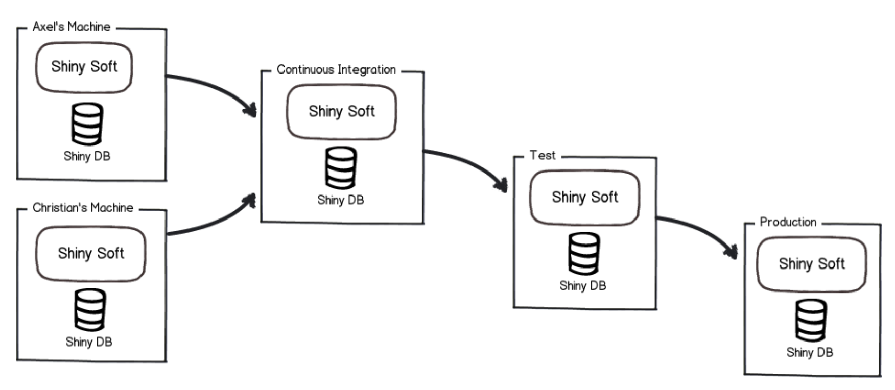
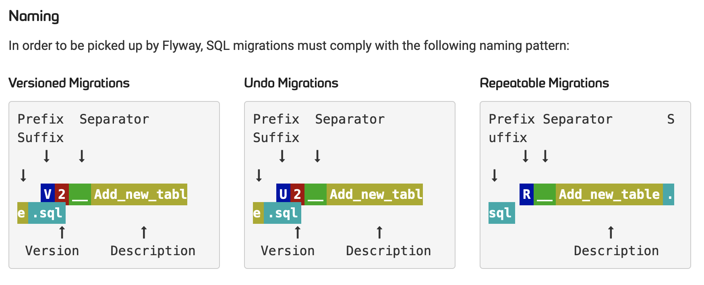

# 1. docker 로 MariaDB 설치
## 1.1.  Official Image
* https://hub.docker.com/_/mariadb
## 1.2. 다운로드
```
docker pull mariadb
```
## 1.3. 실생
### 1.3.1. docker run
~~~Bash
docker run -d -p 3306:3306 -e MYSQL_ROOT_PASSWORD=sample2021 --name mariadb mariadb
~~~

#### Database 생성
~~~mariadb
create database sample_db CHARACTER SET utf8mb4 COLLATE utf8mb4_unicode_ci;
~~~

#### 사용자 생성 및 권한
~~~mariadb
CREATE USER 'sample'@'%' IDENTIFIED BY 'sample2021';
GRANT ALL PRIVILEGES ON sample_db.* TO 'sample'@'%';
FLUSH PRIVILEGES;
~~~

### 1.3.2 docker compose로 설치
* MariaDB 실행후 Database 생성, 사용자 생성 및 권한을 한번에 진행 할 수 있을까?]
    * docker-compose 사용
    * Docker 이미지의 ubuntu 의 타임존 UTC
        * MariaDB는 OS의 타임존을 따르기 때문에 UTC임
            * Asia/Seoul로 변경
    *  docker-compose.yml
```yaml
version: '3.1'

services:
  mysqldb:
      image: mariadb
#      restart: always
      command: ['--character-set-server=utf8mb4', '--collation-server=utf8mb4_unicode_ci']
      ports:
        - "3306:3306"
      environment:
        - MARIADB_ROOT_PASSWORD=root
        - MARIADB_ROOT_HOST=%
        - MARIADB_USER=sample
        - MARIADB_PASSWORD=sample2021
        - MARIADB_DATABASE=sample_db
        - TZ=Asia/Seoul
```

# 2. DB도 형상 관리를 해보자(Flyway)
* 개발자들의 흔한 실수
  * DB 스카가 변경됨
      * 서버에 반영시 DB 스카마 변경 안함
          * 서버가 안뜬다.
          * 로컬에서 잘 동작하는 소스가 버그
  * 해결하는 방안이 있을까?
      * DB도 형상 관리를 해보자

## 2.2 형상 관리 흐름

* Axel과 Christian이 별개로 DDL을 만들고
  * 서버로 배포할 때 자동화 빌드 과정에서 함께 통합하여 DDL을 실행

## 2.4. 의존성 및 환경 설정
```xml

```
### 2.5. 파일명 작성 규칙    

* Prefix - V, U, R 중 하나를 입
  * V는 Verion
  * U는 undo
  * R은 Repeatable
* Version
  * 버전 정보입니다. 정수, 소수, 날짜 등이 가능
* Seperator - 
  * __ ( underscore 2개를 이용 )
* Description 
  * 추가되는 설명
  * _ (underscore)가 space를 대신

  
  
